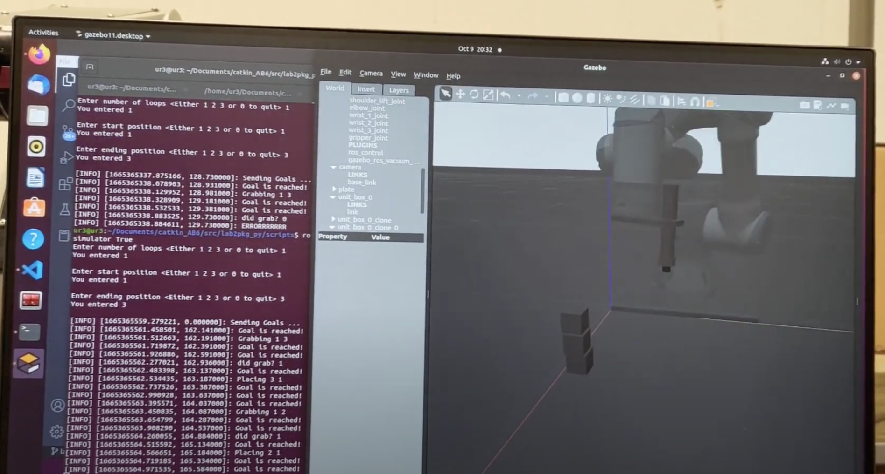

# Project Title: Ethan’s Mom - cockroach killer

Team members: Christopher Xu, Vanessa Blas, Ethan Hsiao

Languages: ROS scripts that control the robot are written in Python 3. Drivers are imported in C++.

Our robot arm will first identify moving cockroaches, terminate the roaches, then dispose of the roaches in a trash bin set in a known position. The arm will start holding a flyswatter. It will use a webcam to detect moving cockroaches and rotate the swatter down to hit each of them quickly. After all of the roaches are hit, the arm will drop the flyswatter and pick up each dead roach then drop it in the trash. For simplicity, we will represent cockroaches as small blocks. 

Use the project to test arm movement and sensors (Deliverable #1)
To use the project, clone and run catkin_make in the main folder. This takes a few minutes. Then, run roslaunch ur3driver ur3_gazebo.launch to start up the gazebo simulator. You should see a 3D world with the UR3 robot loaded in. Inside the gazebo interface, create 3 cubes with side lengths 3cm and stack them on top of each other. Move this stack underneath where the robot arm starts. Alternatively, load the file named 3blocks. Pause the gazebo simulation and then run rosrun lab2pkg_py lab2_exec.py --simulator True. In deliverable #1, the arm will attempt to solve the tower of hanoi. Resume the gazebo simulation, then type in the rosrun terminal 1, 1, and 3, meaning we want to run the program 1 time, the starting position is in 1, and the ending position is in 3. The arm should start moving and attempting to pick up the blocks. If it is trying to pick up a block, it continues if the gripper is intersecting a block, and stops the program if the block is not detected at that location. In the video, the arm detects the first two blocks it tries to pick up, but does not pick them up successfully. When the arm tries to pick up its third block, the block is not in the correct position so the sensor feedback tells the program to stop, printing “ERRORRRRRRR”. See [lab2](http://coecsl.ece.illinois.edu/ece470/Lab2_Manual.pdf) for more information.

The motivation for this project is to find a modern solution to our century old problem. We need something that can kill cockroaches without human assistance so humans can spend time on more important tasks.
Some possible challenges that the team may encounter include how to implement the addition of the flyswatter and the change from flyswatter to pick-up. Another challenge includes how to implement movement of the block to represent the movement of cockroaches. Features to implement in the future would be possibly having different sized blocks to represent different sized pests, or have a certain goal of killing rate/surface area.
The reasoning behind using Gazebo is that it best represents a simulation of real physics through the pick and place task. Gazebo allows us to simulate the exact same code on the virtual UR3 arm, so we have the convenience of transfering code meant for the real arm directly to simulation. In the future, we can easily use the same code for simulation on the real robot.
The next step for the project is to actually build up the backbone codes needed to simulate a cockroach roaming through the workspace and let the camera capture its position. 
We’re very proud of the fact that we can make changes in the codes and visualize those changes in real-time simulations.
We learned in this project that solving problems in simulations can save a lot of time and resources. As long as we get on track of building the environment, it’ll be more than easy for us to test out any situation within minutes.
